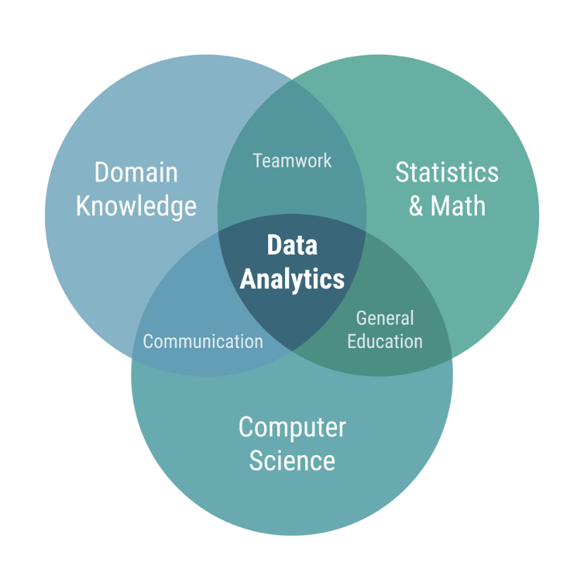
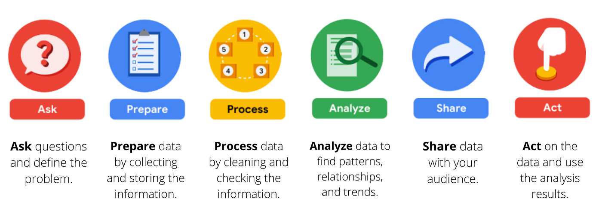

# Foundations of Data Analytics: The Data Analytics Lifecycle



## Introduction
The Data Analytics Lifecycle is a core framework introduced in the Google Data Analytics Professional Certificate. It provides a structured, chronological approach to solving business problems using data. Whether you are analyzing a small spreadsheet or a 100,000+ row database like the Olist E-commerce dataset, following this 6-step lifecycle ensures your analysis is accurate, relevant, and actionable.

The six phases are: **Ask, Prepare, Process, Analyze, Share, and Act.**


---

## 1. Ask (Defining the Problem)
The first phase is all about understanding the business problem, identifying the stakeholders, and asking the right questions. 

### Key Concepts:
* **Identify the Stakeholders:** Who are you solving this problem for? (e.g., Marketing team, CEO, clients).
* **Define the Problem:** What is the core issue? (e.g., "Why are sales dropping in Q3?" instead of just "Look at Q3 sales").
* **SMART Questions:** Questions must be:
  * **S**pecific: Targeted and focused.
  * **M**easurable: Can be quantified.
  * **A**ction-oriented: Designed to bring about change.
  * **R**elevant: Matters to the business goals.
  * **T**ime-bound: Has a specific timeframe.

---

## 2. Prepare (Collecting and Storing Data)
Once the problem is defined, you must figure out what data you need, where it lives, and how to access it securely.

### Key Concepts:
* **Data Sources:** First-party (internal CRM/databases), Second-party (shared by partners), Third-party (public datasets, APIs).
* **Data Organization:** Structured (SQL databases, Excel) vs. Unstructured (Text, images).
* **Data Ethics & Privacy:** Ensuring compliance with laws (GDPR) and ensuring sensitive PII (Personally Identifiable Information) is anonymized or encrypted.
* **Tools Used:** SQL (for extraction), APIs (using Python `requests`), Web Scraping (`BeautifulSoup`).

### Practical Example (Extracting Data using SQL):
```sql
-- Extracting relevant data for analysis from a MySQL Database
SELECT 
    customer_id, 
    order_date, 
    total_amount 
FROM orders 
WHERE order_date BETWEEN '2025-01-01' AND '2025-12-31';
```

---

## 3. Process (Cleaning and Transforming Data)
Raw data is rarely ready for analysis. The processing phase is where you clean the data to ensure accuracy and integrity. "Garbage in, garbage out."

### Key Concepts:
* **Data Integrity:** Ensuring data is accurate, consistent, and reliable.
* **Cleaning Tasks:** 
  * Removing duplicates.
  * Handling NULL or missing values (Imputation or Deletion).
  * Standardizing formats (e.g., making all text lowercase, standardizing date formats to `YYYY-MM-DD`).
  * Identifying and handling outliers.

### Practical Example (Data Cleaning in Python/Pandas):
```python
import pandas as pd

# Load the dataset
df = pd.read_csv('ecommerce_data.csv')

# 1. Drop duplicate rows
df = df.drop_duplicates()

# 2. Handle missing values (Fill missing numerical values with the mean)
df['revenue'] = df['revenue'].fillna(df['revenue'].mean())

# 3. Standardize text data
df['city'] = df['city'].str.lower().str.strip()

print("Data Cleaning Complete. Missing values remaining:", df.isnull().sum().sum())
```

---

## 4. Analyze (Finding Patterns and Insights)
This is where the heavy lifting happens. You use tools to transform, sort, filter, and aggregate the data to uncover trends and relationships that answer the questions asked in Phase 1.

### Key Concepts:
* **Calculations & Aggregations:** Using `SUM`, `AVG`, `COUNT`, `MAX`, `MIN`.
* **Data Transformation:** Creating new calculated columns (e.g., calculating Profit from Revenue and Cost).
* **Statistical Analysis:** Finding correlations, distributions, and variance.
* **Tools Used:** Python (Pandas, NumPy), Advanced Excel (Pivot Tables), SQL (GROUP BY, Window Functions).

### Practical Example (Aggregation in MySQL):
```sql
-- Finding the average order value and total revenue grouped by city
SELECT 
    city,
    COUNT(order_id) AS total_orders,
    AVG(total_amount) AS average_order_value,
    SUM(total_amount) AS total_revenue
FROM cleaned_orders
GROUP BY city
HAVING total_revenue > 50000
ORDER BY total_revenue DESC;
```

---

## 5. Share (Visualizing and Storytelling)
Data means nothing if the stakeholders cannot understand it. The share phase involves creating visual representations of your findings and crafting a compelling narrative.

### Key Concepts:
* **Data Storytelling:** A good data story has a setup (the problem), a conflict (the data insights/challenges), and a resolution (the actionable recommendation).
* **Choosing the Right Visuals:**
  * *Line Charts:* For trends over time.
  * *Bar Charts:* For comparing categories.
  * *Scatter Plots:* For showing relationships/correlations between two numerical variables.
* **Tools Used:** Tableau Public, Power BI, Python (`Matplotlib`, `Seaborn`).

### Practical Example (Visualization with Matplotlib/Seaborn):
```python
import seaborn as sns
import matplotlib.pyplot as plt

# Creating a bar plot to visualize revenue by city
plt.figure(figsize=(10, 6))
sns.barplot(x='city', y='total_revenue', data=city_summary_df, palette='viridis')

plt.title('Total Revenue by City')
plt.xlabel('City')
plt.ylabel('Revenue (USD)')
plt.xticks(rotation=45)
plt.show()
```

---

## 6. Act (Implementing Solutions)
The final phase is the culmination of the entire lifecycle. You provide your findings and recommendations to the business, and they use them to make data-driven decisions.

### Key Concepts:
* **Delivering the ROI:** How does your analysis save money, make money, or improve efficiency?
* **Next Steps:** Proposing concrete actions based on the data. (e.g., "Increase marketing spend in City A by 15% because our analysis shows a 30% higher customer retention rate there.")
* **Iteration:** Data analytics is an ongoing process. Acting on data often leads to new questions, starting the lifecycle over again.

---

| Status:     | Skills Unlocked:         |
| :---------- | :----------------------- |
| Completed ✅ | Data Analytics Lifecycle |

**Next Step:** Moving towards [Data Life Cycle](01.02-Data_Life_Cycle.md).