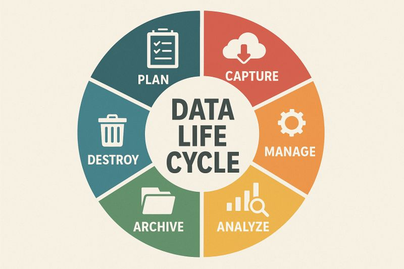

# Data Life Cycle: Strategic Data Management

## Overview
While the **Data Analysis Process** (Ask, Prepare, Process, Analyze, Share, Act) describes the steps an analyst takes to complete a specific project, the **Data Life Cycle** describes the entire lifespan of data within an organization. Understanding this cycle is critical for **Data Governance**—the set of processes that ensure data is high-quality, secure, and accessible throughout its existence.

---

## 1. The Six Stages of the Data Life Cycle
In the **Google Data Analytics Professional Certificate**, the life cycle is defined by how data is planned for, gathered, and eventually retired.

### Stage 1: Plan
Before a single byte of data is collected, an analyst must participate in planning.
* **Objective:** Decide what kind of data is needed, how it will be managed, and who will be responsible for it.
* **Key Task:** Defining the data standards and naming conventions to ensure consistency.

### Stage 2: Capture
Collecting or bringing in data from a variety of different sources.
* **Direct Capture:** Gathering data from internal CRM systems or transaction logs.
* **Indirect Capture:** Pulling data from third-party APIs or external datasets.
* **Integrity Check:** Ensuring that the capture process does not introduce errors (e.g., truncated strings or incorrect data types).

### Stage 3: Manage
Caring for and maintaining the data.
* **Storage Logic:** Determining how and where it is stored (Cloud vs. On-premise) and the tools used (MySQL, BigQuery).
* **Maintenance:** Regularly updating metadata and ensuring that data remains accessible to authorized users.

### Stage 4: Analyze
Using the data to solve problems, make decisions, and support business goals.
* **The Connection:** This stage is where the 6-phase Data Analysis Process is executed.
* **Value Extraction:** Transforming raw data into the insights that drive business ROI.

### Stage 5: Archive
Keeping relevant data stored for long-term and future reference.
* **Long-term Storage:** Moving historical data that is no longer used for daily operations to "cold storage" to save costs.
* **Compliance:** Many industries require data to be kept for 5–10 years for legal audits.

### Stage 6: Destroy
Removing data from storage and deleting any shared copies.
* **Security:** Securely wiping data to ensure no PII (Personally Identifiable Information) can be recovered.
* **Privacy Compliance:** Deleting data is just as important as collecting it, especially under laws like GDPR and CCPA.

---

## 2. Comparison: Life Cycle vs. Analysis Process
It is vital for a professional analyst to distinguish between the management of data (Life Cycle) and the analysis of data (Process).

| Feature | Data Life Cycle | Data Analysis Process |
| :--- | :--- | :--- |
| **Scope** | The "Existence" of data in the system. | The "Workflow" of a specific project. |
| **Goal** | Governance and Data Health. | Solving a business problem. |
| **Duration** | From creation to deletion (years). | From question to recommendation (weeks/months). |
| **Stages** | Plan, Capture, Manage, Analyze, Archive, Destroy. | Ask, Prepare, Process, Analyze, Share, Act. |

---

## 3. Practical Implementation & Automation

### Data Integrity Audit (SQL)
During the **Manage** stage, analysts use SQL to ensure that the data captured matches the expected volume and structure.
```sql
-- Identifying data capture gaps by checking record counts per day
SELECT 
    DATE(capture_timestamp) AS capture_date,
    COUNT(*) AS total_records_captured
FROM raw_sensor_data
GROUP BY capture_date
ORDER BY capture_date DESC;
```

### Secure Data Deletion (Python)
In the **Destroy** stage, analysts may be tasked with automating the removal of expired or sensitive data.
```python
import pandas as pd
from datetime import datetime, timedelta

# Identify and remove records older than the retention policy (e.g., 3 years)
def enforce_retention_policy(df, date_col, years=3):
    retention_cutoff = datetime.now() - timedelta(days=years*365)
    # Keep only data within the retention period
    df_retained = df[df[date_col] >= retention_cutoff]
    print(f"Policy Enforced: {len(df) - len(df_retained)} records identified for destruction.")
    return df_retained

# df_cleaned = enforce_retention_policy(user_data_df, 'last_active_date')
```

---

| Status:     | Skills Unlocked:                            |
| :---------- | :------------------------------------------ |
| Completed ✅ | Data Governance, Data Retention Compliance. |

**Next Step:** Moving from theory to practice by applying [Structured Thinking](01.03-Structured_Thinking_and_Problem_Solving.md).