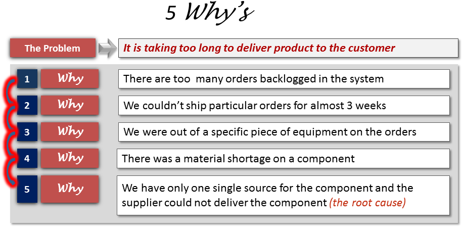
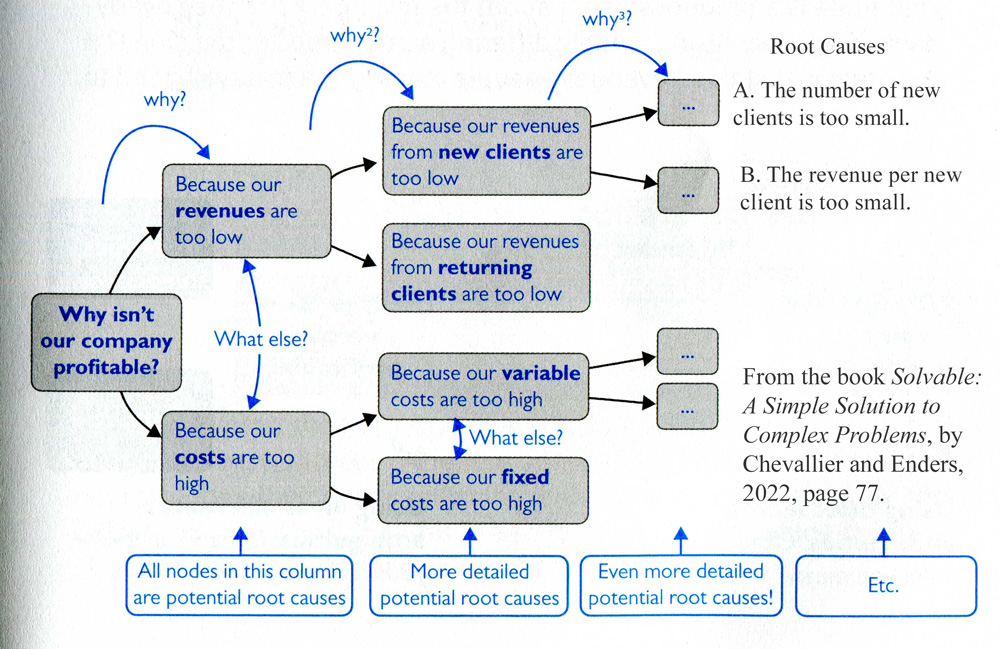
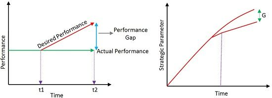
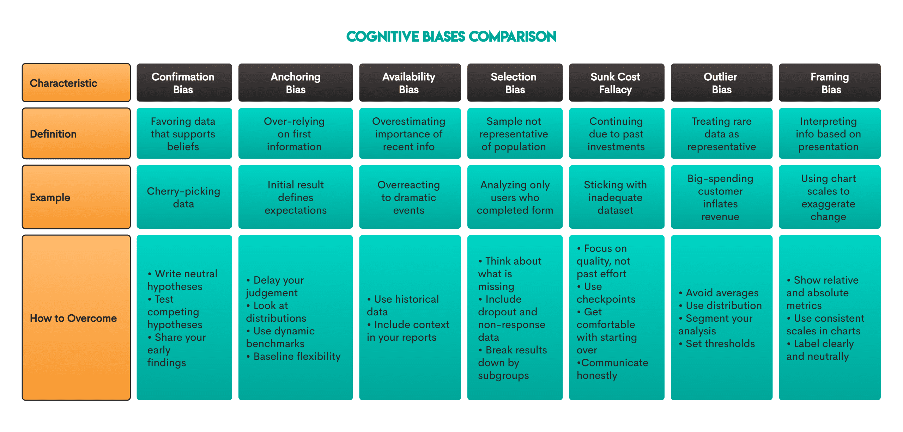

# Structured Thinking & Problem Solving in Data Analytics

## 1. Introduction to Structured Thinking
**Structured thinking** is the process of recognizing the current problem or situation, organizing available information, revealing gaps and opportunities, and identifying the options. 

As a Data Analyst, stakeholders will rarely give you perfectly framed questions. They will give you symptoms (e.g., "Sales are dropping in the West region"). Structured thinking is how you translate that symptom into a root cause and, eventually, a data-driven solution.

---

## 2. Key Problem-Solving Frameworks

### A. The 5 Whys (Root Cause Analysis)
A simple but powerful technique to find the exact root cause of a problem by asking "Why?" consecutively.



Example:
* **Problem Statement:** Website traffic dropped by 20% this month.
* *Why?* Because organic search traffic decreased.
* *Why?* Because our main product pages lost search engine ranking.
* *Why?* Because the website load speed increased significantly.
* *Why?* Because a recent update added large, unoptimized images.
* *Why?* Because there is no automated image optimization in the deployment pipeline. (Root Cause)

### B. Issue Trees (Logic Trees)
A visual tool that breaks down a complex problem into smaller, manageable, and mutually exclusive parts (MECE - Mutually Exclusive, Collectively Exhaustive).



* **Core Issue:** Profitability is down.
* **Branch 1:** Revenues are down. (Sub-branches: Price per unit decreased? Volume decreased?)
* **Branch 2:** Costs are up. (Sub-branches: Fixed costs increased? Variable costs increased?)

### C. Gap Analysis



A method used to compare a company's current performance against its desired performance.
1.  **Current State:** Where are we right now?
2.  **Future State:** Where do we want to be?
3.  **The Gap:** What is preventing us from reaching the future state?
4.  **Action Plan:** What data do we need to bridge this gap?

---

## 3. Cognitive Biases to Avoid



When solving problems, human brains often rely on shortcuts. A data analyst must actively fight against these biases:
* **Confirmation Bias:** Searching for or interpreting data in a way that confirms your pre-existing beliefs. (e.g., Only looking at metrics that prove your marketing campaign worked, while ignoring high bounce rates).
* **Anchoring Bias:** Relying too heavily on the first piece of information offered.
* **Overconfidence Bias:** Overestimating your own ability to predict outcomes based on the data.

---

## 4. Applying Structured Thinking in Code
Structured thinking isn't just for whiteboard meetings; it applies directly to how you write your code. Instead of writing massive, confusing, nested queries or scripts, you should break your code down into logical, sequential steps.

### Example 1: Structured SQL using CTEs (Common Table Expressions)
If a stakeholder asks: *"Which regions saw a drop in sales in Q4 compared to Q3, and by how much?"*

Instead of a messy subquery, a structured thinker breaks this into logical steps:

```sql
-- Step 1: Isolate Q3 Sales
WITH Q3_Sales AS (
    SELECT region, SUM(sales_amount) as total_q3
    FROM sales_data
    WHERE quarter = 'Q3' AND year = 2025
    GROUP BY region
),

-- Step 2: Isolate Q4 Sales
Q4_Sales AS (
    SELECT region, SUM(sales_amount) as total_q4
    FROM sales_data
    WHERE quarter = 'Q4' AND year = 2025
    GROUP BY region
)

-- Step 3: Combine, Compare, and Filter (The Gap)
SELECT 
    q3.region, 
    q3.total_q3, 
    q4.total_q4,
    (q4.total_q4 - q3.total_q3) AS difference
FROM Q3_Sales q3
JOIN Q4_Sales q4 ON q3.region = q4.region
WHERE q4.total_q4 < q3.total_q3;
```

### Example 2: Structured Python Workflow
When analyzing a dataset using Pandas, apply structured thinking to your pipeline: Ask, Prepare, Process, Analyze.

```python
import pandas as pd

# 1. PREPARE: Load the data safely
try:
    df = pd.read_csv('ecommerce_transactions.csv')
except FileNotFoundError:
    print("Error: Data file not found.")

# 2. PROCESS: Clean the data (Handle nulls, fix types)
def clean_data(data):
    # Drop rows where critical transaction ID is missing
    data = data.dropna(subset=['transaction_id'])
    # Ensure dates are datetime objects
    data['date'] = pd.to_datetime(data['date'])
    return data

df_clean = clean_data(df)

# 3. ANALYZE: Create focused aggregates
def get_monthly_revenue(data):
    # Extract month
    data['month'] = data['date'].dt.to_period('M')
    # Group and sum
    monthly_rev = data.groupby('month')['revenue'].sum().reset_index()
    return monthly_rev

monthly_revenue_summary = get_monthly_revenue(df_clean)
print(monthly_revenue_summary)
```

---

## 5. The S.M.A.R.T. Problem Statement
Before writing any code or pulling any data, ensure the problem you are solving is S.M.A.R.T.:
* **Specific:** Is the question clear?
* **Measurable:** Can we quantify the answer?
* **Action-Oriented:** Will the answer lead to a business decision?
* **Relevant:** Does it matter to the company's current goals?
* **Time-Bound:** What is the timeframe being analyzed?

**Bad Problem Statement:** "Find out why customers are unhappy."
**S.M.A.R.T Problem Statement:** "Identify the top three product categories with the highest return rates in Q2 2025 to help the inventory team reduce defects by 10% in Q3."

---

| Status:     | Skills Unlocked:  |
| :---------- | :---------------- |
| Completed ✅ | Critical Thinking |

**Next Step:** Implementing these logic models within [Spreadsheet Basics](01.04-Spreadsheet_Basics.md).