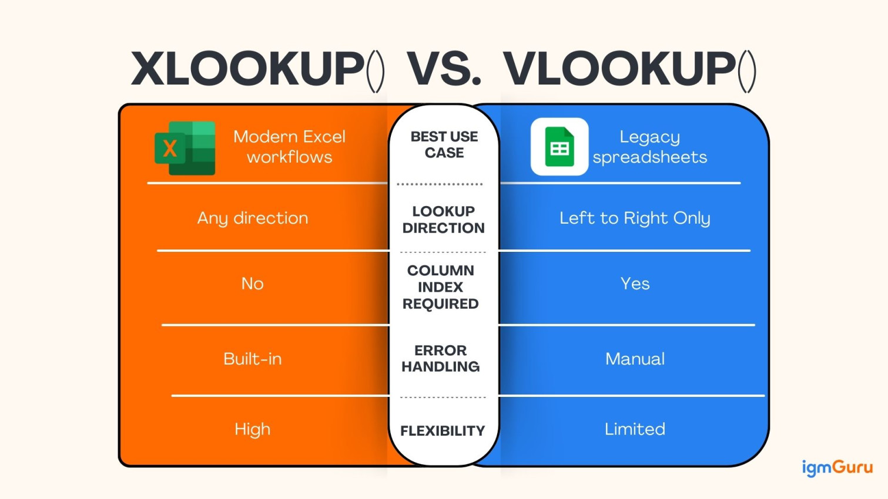

# Advanced Excel: Data Architecture, Analytics & Automation

## Overview
While basic spreadsheet skills focus on data entry and simple arithmetic, **Advanced Excel** involves building scalable data models, conducting sophisticated statistical analysis, and automating repetitive workflows. This module bridges the gap between simple data tracking and robust business intelligence, as utilized in professional data analyst roles.



---

## 1. Modern Data Lookup: The XLOOKUP Revolution
`XLOOKUP` is the powerful successor to `VLOOKUP` and `HLOOKUP`. It is more resilient because it does not require a specific column index number and can look up data both to the left and right of the search key.

**Syntax:** `=XLOOKUP(lookup_value, lookup_array, return_array, [if_not_found], [match_mode])`

### Example 1: Basic Vertical Lookup (Left-to-Right)
Find the "Sales Amount" for a specific "Order ID."
```excel
// Table: Orders (Cols A to C: OrderID, Customer, Sales)
=XLOOKUP("ORD-101", A2:A500, C2:C500)
// Result: Searches for "ORD-101" in Column A and returns the corresponding value from Column C.
```

### Example 2: Resilience (Right-to-Left Lookup)
Unlike `VLOOKUP`, `XLOOKUP` can return data located to the left of the lookup column.
```excel
// Find the "Customer Name" based on a "Phone Number" located in a column further to the right.
=XLOOKUP("999-000-111", D2:D500, B2:B500)
```

### Example 3: Handling Missing Data
Automatically handle errors without using an external `IFERROR` function.
```excel
=XLOOKUP("ORD-999", A2:A500, C2:C500, "Order Not Found")
```

---

## 2. Dynamic Array Functions
Dynamic arrays allow a single formula to return a "spill" of multiple values across several cells.

* **UNIQUE:** Extracts a list of distinct values from a range.
```excel
    =UNIQUE(B2:B500) // Returns a unique list of all departments.
```
* **FILTER:** Filters a dataset based on criteria and displays all matching records.
```excel
    =FILTER(A2:D500, B2:B500="Marketing") // Displays all rows belonging to "Marketing".
```
* **SORT:** Automatically sorts a range or array.
```excel
    =SORT(FILTER(A2:D500, C2:C500 > 5000), 3, -1) // Filters for sales > 5000, then sorts by Column 3 descending.
```

---

## 3. Advanced Pivot Table Techniques
To move beyond basic summaries, an advanced analyst uses:
* **Calculated Fields:** Creating new data metrics inside the Pivot Table (e.g., `Profit = Revenue - Cost`).
* **Slicers & Timelines:** Creating interactive dashboards that allow users to filter data visually with a single click.
* **GETPIVOTDATA:** A function used to extract specific data points from a pivot table into a custom report layout while maintaining data integrity even if the pivot table layout changes.

---

## 4. Analytical Modeling & "What-If" Analysis
Professional modeling requires testing different business scenarios:
* **Goal Seek:** Used when you know the desired result of a formula but need to find the input value required to achieve it (e.g., "What sales volume do I need to reach a 20% profit margin?").
* **Solver:** An optimization tool used to find the best way to allocate resources (e.g., minimizing costs while meeting production targets).
* **Data Tables:** Visualizing how changing one or two variables affects a specific outcome (e.g., how different interest rates and loan terms affect a monthly payment).

---

## 5. Automation: Power Query & Macros
* **Power Query (M Language):** The industry standard for ETL (Extract, Transform, Load). It allows you to connect to external databases, clean millions of rows, and automate the cleaning steps so that a simple "Refresh" processes new data automatically.
* **VBA (Macros):** Using Visual Basic for Applications to automate repetitive manual tasks, such as generating monthly PDF reports or custom user forms.

---

| Status:     | Skills Unlocked: |
| :---------- | :--------------- |
| Completed ✅ | Advanced Excel   |

**Next Step in Learning Path:** Transitioning to [MySQL: Database Creation, Data Types, and Constraints](../12-MySQL/12.01-MySQL_Creation_Types_Constraints.md) to handle datasets larger than 1 million rows.
