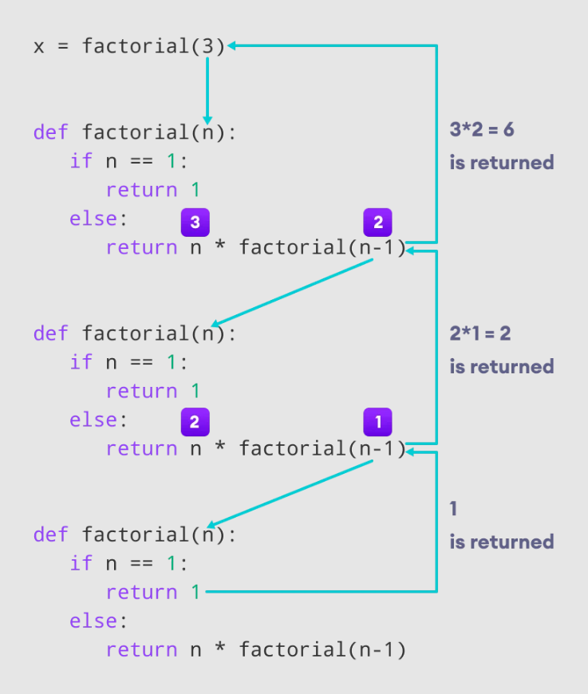
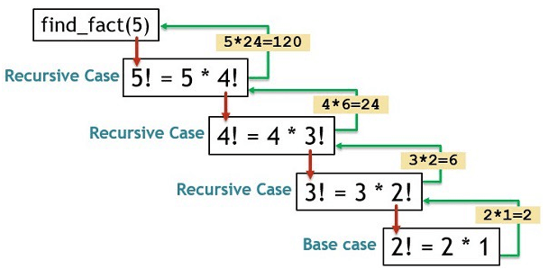

# Functions & Recursion in Python

## Overview
As you build more complex programs, writing the same logic repeatedly becomes inefficient. **Functions** are reusable blocks of code that perform a specific task. They help in organizing code, making it readable, and adhering to the DRY (Don't Repeat Yourself) principle. **Recursion** is an advanced functional concept where a function calls itself to solve smaller instances of the same problem.

---

## 1. Introduction to Functions
A function is a group of related statements that performs a specific task. It only runs when it is called. You can pass data, known as parameters, into a function. A function can return data as a result.
For a full alphabetical list of Python 3.13's 71 built-in functions, see the [official Python documentation](https://docs.python.org/3/library/functions.html). You can also check out this [Python file](../linked_files/python_functions.py), which explains their use cases and syntax.

### Built-in vs. User-Defined Functions
* **Built-in Functions:** Provided by Python natively (e.g., `len()`, `print()`, `range()`, `type()`).
* **User-Defined Functions:** Created by the programmer to perform specific tasks.

---

## 2. Defining and Calling a Function
In Python, a function is defined using the `def` keyword, followed by the function name, parentheses `()`, and a colon `:`. The code block within every function starts with an indentation.

```python
# Defining a function
def greet_user():
    print("Hello! Welcome to Data Analytics.")

# Calling the function
greet_user()
```

---

## 3. Arguments and Parameters
Information can be passed into functions as arguments. 
* **Parameter:** The variable listed inside the parentheses in the function definition.
* **Argument:** The actual value that is sent to the function when it is called.

### Positional vs. Keyword Arguments
```python
def introduce(name, role):
    print(f"My name is {name} and I am a {role}.")

# Positional Arguments (Order matters)
introduce("Animesh", "Data Analyst")

# Keyword Arguments (Order doesn't matter)
introduce(role="Data Scientist", name="Rohan")
```

### Default Parameters
You can assign a default value to a parameter. If the function is called without an argument, it uses the default value.

```python
def greet(name="Guest"):
    print(f"Hello, {name}!")

greet("Animesh")  # Output: Hello, Animesh!
greet()           # Output: Hello, Guest!
```

---

## 4. The `return` Statement
A function can process data and send a result back to the caller using the `return` statement. Once a `return` statement is executed, the function terminates.

```python
def add_numbers(a, b):
    result = a + b
    return result

# Capturing the returned value in a variable
total = add_numbers(10, 15)
print(f"The total is {total}") # Output: The total is 25
```

---

## 5. Recursion
Recursion is a programming technique where a function calls itself directly or indirectly. It is highly useful for mathematical problems and traversing complex data structures.

### The Two Rules of Recursion:
1. **Base Case:** A condition that stops the recursion from continuing indefinitely (preventing a stack overflow / infinite loop).
2. **Recursive Case:** The part where the function calls itself with a modified parameter, moving closer to the base case.

### Example: Calculating Factorial
The factorial of a number *n* is the product of all positive integers less than or equal to *n* (e.g., 5! = 5 * 4 * 3 * 2 * 1 = 120).
* **Mathematical definition:** `n! = n * (n-1)!`
* **Base case:** `1! = 1` and `0! = 1`

```python
def factorial(n):
    # Base Case
    if n == 0 or n == 1:
        return 1
    # Recursive Case
    else:
        return n * factorial(n - 1)

print(factorial(5))  
```

 

```python
# Execution Steps:
# 5 * factorial(4)
# 5 * (4 * factorial(3))
# 5 * (4 * (3 * factorial(2)))
# 5 * (4 * (3 * (2 * factorial(1))))
# 5 * 4 * 3 * 2 * 1 = 120
```



### Why use Recursion?
* **Pros:** Makes code look clean, elegant, and simple for problems that can be broken down into similar sub-problems (like tree traversals or mathematical sequences).
* **Cons:** Sometimes harder to trace/debug. If the base case is missing, it will cause an infinite loop and crash the program. It can also consume a lot of memory for deep recursive calls.

---

| Status:     | Skills Unlocked:        |
| :---------- | :---------------------- |
| Completed ✅ | Mapping Data Structures |
**Next Step in Learning Path:** Transitioning from functional programming concepts to Object-Oriented Programming (OOP) to structure larger Python applications. [click here](../04-OOP_and_Advanced_Python/04.01-Classes_Objects_Attributes.md)